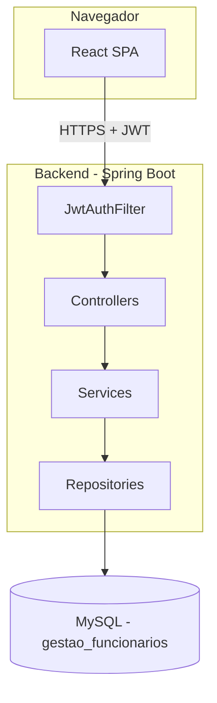

Arquitetura da aplicacao

Fluxo de autenticacao

O usuario envia username e senha para POST /api/auth/login. O
AuthController delega para o AuthenticationManager do Spring Security, que
valida a senha usando BCrypt. Se valido, o JwtService gera um token
assinado com expiracao de 1 hora. O frontend guarda o token no
localStorage e passa a enviar Authorization: Bearer <token> em toda
chamada seguinte. O JwtAuthFilter valida o token em cada requisicao.

Camadas do backend

model        entidades JPA, representam as tabelas do banco
controller   recebe requisicoes HTTP, delega para os services
service      regras de negocio (validacao de duplicidade, vinculos, relatorio)
repository   acesso a dados via Spring Data JPA
frontend     consome a API via JSON

Logs

Cada requisicao recebe um requestId unico (RequestCorrelationFilter),
propagado via MDC e incluido em todo log emitido durante o processamento -
util pra rastrear todas as linhas de log de uma mesma requisicao, mesmo com
varias requisicoes acontecendo ao mesmo tempo.
