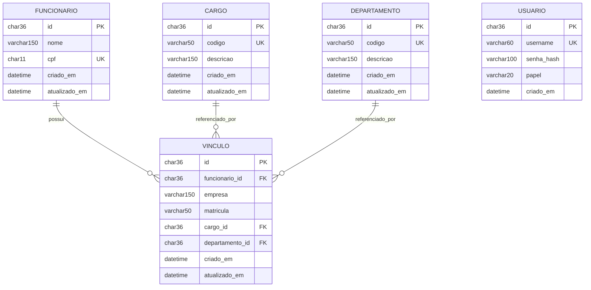

Diagrama entidade-relacionamento

Cardinalidades

Um funcionario pode ter zero ou muitos vinculos (varias empresas). Um
vinculo pertence a exatamente um funcionario - se o funcionario for
excluido, os vinculos dele vao junto (ON DELETE CASCADE).

Um cargo pode estar em varios vinculos, mas um vinculo tem exatamente um
cargo. Nao da pra excluir um cargo que esteja em uso (ON DELETE RESTRICT).
O mesmo vale para departamento.

Usuario e independente das demais tabelas, usado so para login da API.

Regras de negocio e onde estao no banco:

CPF nao pode duplicar -> UNIQUE (cpf) em funcionario
Codigo de cargo nao pode duplicar -> UNIQUE (codigo) em cargo
Codigo de departamento nao pode duplicar -> UNIQUE (codigo) em departamento
Matricula nao pode duplicar na mesma empresa -> UNIQUE (empresa, matricula) em vinculo
Cargo/departamento devem vir dos cadastros existentes -> foreign keys em vinculo
Funcionario pode ter varios vinculos -> relacao 1:N entre funcionario e vinculo

Script completo em ../database/schema.sql.
